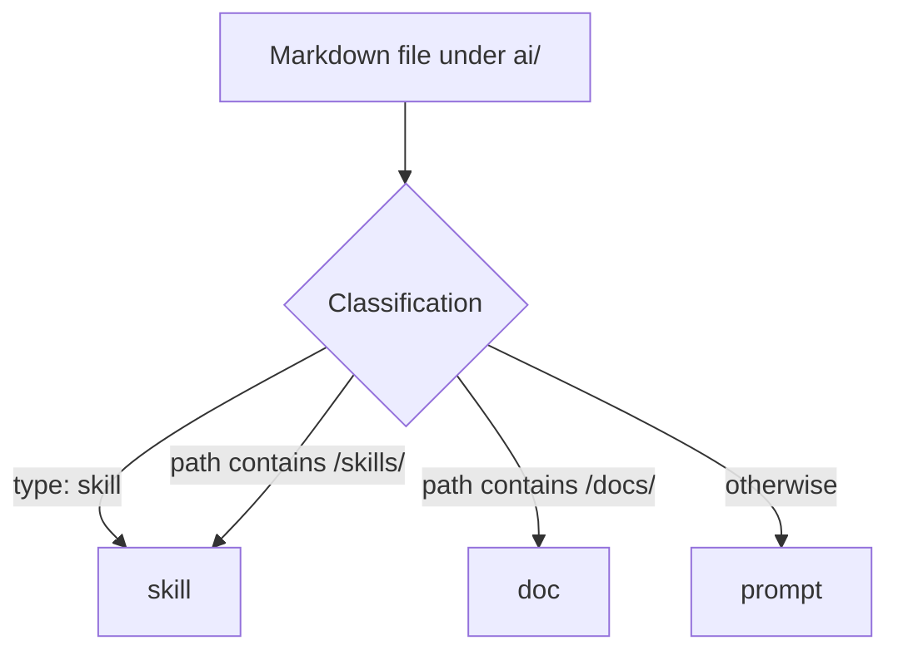
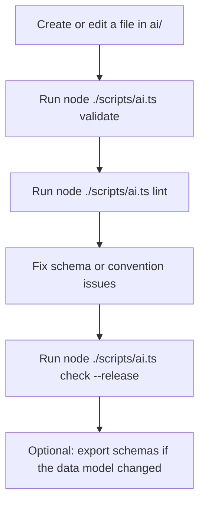

This document explains the purpose, structure, and working model of the `ai/` directory and the `scripts/ai.ts` tool that manages it. It is intended as the main reference for contributors who add, edit, validate, or reorganise AI-related files in this repository.

## Why this system exists

The `ai/` directory is a structured registry of AI-facing assets. Each file inside that registry is expected to be understandable to humans, machine-validated, and predictable enough to be inspected by scripts and editors.

The overall goals are:

* keep prompts, skills, and supporting documents in one clearly defined place
* make each item self-describing through front matter
* validate metadata and file naming consistently
* make the registry inspectable from the command line
* export JSON schemas for tooling and editor integrations
* reduce drift as the registry grows over time

In short, the `ai/` folder is meant to be both readable content and structured project data.

## High-level layout

The script scans the `ai/` directory recursively. It does not require a completely flat structure and it does not hardcode every possible subfolder. Instead, it applies a small number of conventions to determine what each Markdown file represents.

A recommended layout looks like this:

```text
ai/
├── docs/
│   ├── folder-layout-and-ai-script.doc.md
│   └── workflow-overview.doc.md
├── skills/
│   ├── review-behaviour-spec.skill.md
│   └── test-from-behaviour-spec.skill.md
├── prompts/
│   ├── review-spec.prompt.md
│   └── generate-tests.prompt.md
└── shared/
    └── reusable-helper.prompt.md
```

This is a recommendation rather than a fully rigid technical requirement, but it matches the behaviour of the script and keeps the registry readable.

## How files are classified

The `scripts/ai.ts` script classifies every Markdown file under `ai/` into one of three kinds:

* `prompt`
* `skill`
* `doc`

The logic is intentionally simple.

### `skill`

A file is treated as a skill when one of these is true:

* its front matter explicitly says `type: skill`
* its path contains `/skills/`

### `doc`

A file is treated as a document when its path contains `/docs/`.

### `prompt`

Everything else defaults to `prompt`.

That means prompt is the fallback category. If a Markdown file lives under `ai/` but is not recognised as a skill or doc, it will be treated as a prompt.

This is practical, but it also means placement matters. A misplaced file can change meaning simply because it sits in the wrong folder.

## Visual model



## Naming conventions

In addition to kind detection, the script enforces naming conventions through linting.

Expected suffixes:

* prompts use `.prompt.md`
* skills use `.skill.md`
* docs use `.doc.md`

These suffixes do not perform the primary classification, but they are important conventions because they:

* make file purpose obvious at a glance
* reduce ambiguity during refactors
* make searching and grepping easier
* keep the registry consistent for humans and tools

A file may still be classified correctly even if it uses the wrong suffix, but linting will report that as a problem.

## What each registry item contains

Each parsed file becomes an internal registry item with the following fields:

* `id`
* `title`
* `kind`
* `absolutePath`
* `relativePath`
* `body`
* `frontmatter`

This object is the runtime representation used by listing, validation, linting, display, and schema export.

### `id`

The `id` is taken from frontmatter if present. If it is missing, the script derives it from the filename by removing known suffixes such as `.prompt.md`, `.skill.md`, or `.md`.

Explicit IDs are preferred. Filename fallback exists for convenience, not as the best long-term pattern.

### `title`

The `title` is taken from frontmatter if present. If it is missing, the script falls back to the file basename.

### `kind`

The `kind` is the final classification result: `prompt`, `skill`, or `doc`.

### `body`

The `body` is the Markdown content after the frontmatter block. A file may technically parse with an empty body, but linting reports empty content as an issue.

## Frontmatter requirements

Every file is expected to begin with YAML frontmatter.

The expected structure is:

```md
---
id: some-id
title: Some title
description: What this file is for
---

Markdown body here.
```

The parser requires frontmatter to be present and valid. If the frontmatter block is missing, malformed, or does not parse to an object, the script raises an error.

This gives the registry a strict baseline: every file must describe itself in machine-readable form before any body content is considered.

## Schema source of truth

The runtime script is not the place where the core schema rules live. Those come from `scripts/lib/ai-schema.ts`.

That file provides the shared schema definitions and allowed-key lists used by `scripts/ai.ts`.

The current design intentionally separates concerns:

* `scripts/lib/ai-schema.ts` defines the data model
* `scripts/ai.ts` loads, validates, lints, inspects, and exports data based on that model

This keeps the system maintainable. Schema changes happen in one central place rather than being scattered across the runtime script.

## Commands provided by `scripts/ai.ts`

The script supports several commands.

### `help`

Shows command usage and available options.

### `list`

Lists all registry items under `ai/`.

Plain output is compact and useful for quick overviews. JSON output is available for automation.

Typical uses:

* checking which items the registry currently sees
* verifying IDs
* confirming classification
* quick inspection during refactors

### `show --id <id>`

Shows one registry item in detail.

It includes:

* title
* id
* kind
* file path
* parsed frontmatter
* body content, unless suppressed with `--no-content`

Typical uses:

* debugging one specific file
* checking how the parser sees the frontmatter
* reviewing an item without opening the raw Markdown file

### `validate`

Validates frontmatter against the schema for the detected kind.

That means:

* skills are validated against the skill schema
* docs are validated against the doc schema
* prompts are validated against the prompt schema

`validate` answers the question: "Is this item structurally valid according to the declared rules?"

It does not enforce naming or style conventions. Those belong to linting.

### `lint`

Runs repository-specific checks that go beyond schema validity.

This currently includes checks such as:

* unknown frontmatter keys
* empty body content
* wrong filename suffix for the detected kind
* missing or empty descriptions where required
* wrong types for prompt-specific optional fields such as `skills`, `tools`, or `strict`

`lint` answers the question: "Is this item acceptable according to project policy and maintenance conventions?"

### `drift-report`

Aggregates unknown frontmatter keys across the whole registry.

This is useful for spotting schema drift, one-off experiments, stale keys, or accidental copying of metadata between files.

It is especially valuable during refactors because it answers questions such as:

* which unsupported keys exist
* how widely they are used
* which files need migration first

### `export-schemas`

Exports the Zod-based schemas as JSON Schema files.

This bridges the gap between TypeScript runtime validation and external tooling. It is useful for:

* editor integrations
* external validators
* documentation tooling
* future automation around frontmatter authoring

### `check`

Runs validation and linting together.

This is the best all-purpose health check and the most useful command for CI or release checks.

## CLI options

The script supports a set of options that can be combined with the commands above.

### `--root <path>`

Overrides the AI root directory. By default, the script uses `./ai` relative to the current working directory.

### `--schemas <path>`

Overrides the output directory for exported JSON schemas. The default is `./schemas`.

### `--id <id>`

Used with `show` to select a single registry item.

### `--json`

Switches supported commands to JSON output.

This is useful for scripts, CI, editor tooling, or anything else that consumes machine-readable output.

### `--verbose`

Prints additional diagnostics, especially helpful when a file fails to load or parse.

### `--no-content`

Suppresses the body output when showing a specific item.

### `--release`

Promotes warning-level issues to errors where appropriate. This is intended for stricter release or CI checks.

### `--no-exit-on-error` and `--noExitOnError`

Prevents the script from exiting non-zero on the first reported problems. This is useful for diagnostics or large cleanup runs where you want full output rather than immediate failure.

## The difference between validation and linting

This distinction is one of the most important parts of the system.

### Validation

Validation checks whether the frontmatter matches the schema exactly.

Examples:

* required fields exist
* optional fields have the right type
* the metadata structure matches the Zod contract

### Linting

Linting checks whether the file follows project rules and maintenance expectations.

Examples:

* the file uses the correct suffix
* the body is not empty
* descriptions exist where required
* frontmatter keys do not drift away from the supported model

In other words:

* validation is about correctness
* linting is about quality and consistency

This split is useful because it lets you distinguish between hard invalidity and softer policy violations.

## Prompt-specific metadata

Prompt files may include additional structured metadata such as:

* `skills`
* `tools`
* `strict`

The linter checks these for type correctness.

Expected patterns are:

* `skills` is an array of strings
* `tools` is an array of strings
* `strict` is a boolean

This suggests an intentional content model where prompts may declare dependencies, expected tool usage, or stricter behavioural expectations.

## Description requirements

Docs and prompts are expected to have a non-empty `description`.

This is a strong rule and worth keeping because descriptions are often the most useful field for:

* listings
* editor hints
* generated indexes
* search results
* contributor orientation

A registry with titles but no descriptions tends to become harder to navigate over time.

## Drift detection

Unknown frontmatter keys are detected through an allowed-key list per kind.

This is a protective measure against slow content decay. Without it, unsupported keys tend to accumulate silently and become accidental quasi-standards.

The drift-report command turns that silent drift into something visible and actionable.

## Error handling behaviour

The script follows a fail-fast model by default.

If a file fails to parse or a command reports errors, the process exits non-zero. This is the correct default for automation and CI.

For diagnosis and bulk cleanup, the no-exit options allow the script to continue and report everything it can find in a single run.

## Typical workflow

A sensible day-to-day workflow looks like this:



## Recommended contributor rules

Contributors working in the registry should follow these rules:

* keep all AI registry files inside `ai/`
* always include YAML frontmatter
* prefer explicit `id`, `title`, and `description`
* place docs in `ai/docs/`
* place skills in `ai/skills/`
* use `.doc.md`, `.skill.md`, and `.prompt.md` suffixes consistently
* run `node ./scripts/ai.ts check --release` before considering the registry clean

## Practical examples

### List all AI registry items

```bash
node ./scripts/ai.ts list
```

### Show one item by ID

```bash
node ./scripts/ai.ts show --id folder-layout-and-ai-script
```

### Validate all files

```bash
node ./scripts/ai.ts validate
```

### Lint all files

```bash
node ./scripts/ai.ts lint
```

### Run the full check in release mode

```bash
node ./scripts/ai.ts check --release
```

### Export JSON schemas

```bash
node ./scripts/ai.ts export-schemas
```

## Strengths of the current design

The current design already has several good properties.

### Single source of truth for AI content

The repository no longer treats prompts and related files as unstructured notes. They are explicit project assets.

### Clear separation of model and runtime

Schema definitions live separately from the CLI runtime, which keeps each concern focused.

### Recursive scanning

The registry can grow without being trapped in a brittle flat directory.

### Machine-readable output

JSON output makes the script easy to integrate into CI and future tools.

### Schema export

The JSON Schema export makes the system useful beyond the TypeScript runtime itself.

### Drift visibility

The drift-report command is a particularly useful long-term safeguard.

## Current trade-offs and caveats

A few things are worth stating clearly.

### Path influences meaning

Because docs and skills are partly path-classified, moving a file can change how it is interpreted.

### Prompt is the fallback

This is practical, but it means stray files under `ai/` are treated as prompts unless clearly marked otherwise.

### Naming is policy, not classification

The suffix checks are lint rules rather than the primary detection logic. This is flexible, but it means the repository relies on contributors respecting conventions.
