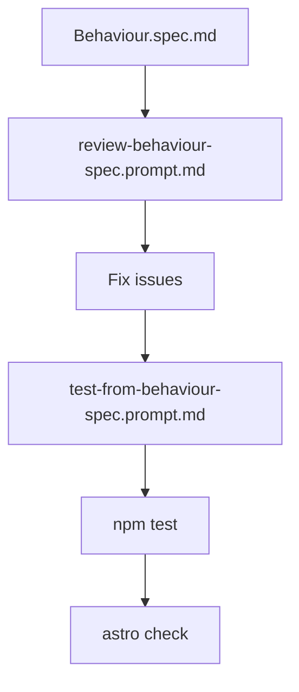

# Behaviour spec workflow

```mermaid
flowchart TD
  A[Behaviour.spec.md]
  B[review-behaviour-spec.prompt.md]
  C[Fix issues]
  D[test-from-behaviour-spec.prompt.md]
  E[npm test]
  F[astro check]

  A --> B
  B --> C
  C --> D
  D --> E
  E --> F
```
