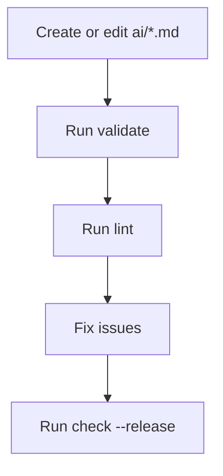

# AI folder layout and `scripts/ai.ts`

The `ai/` directory is a structured registry for AI-facing assets in this repository. Instead of storing prompts, skills, and documentation as loose Markdown files, the project treats them as typed content items with frontmatter, validation rules, naming conventions, and command-line tooling.

## Folder layout

Recommended structure:

```text
ai/
├── docs/
├── skills/
├── prompts/
└── shared/
```

Practical meaning:

* files under `ai/docs/` are treated as docs
* files under `ai/skills/` are treated as skills
* everything else defaults to prompt content unless frontmatter says otherwise

Expected filename suffixes:

* `.doc.md`
* `.skill.md`
* `.prompt.md`

## What `scripts/ai.ts` does

The script scans `ai/` recursively and turns each Markdown file into a registry item with:

* `id`
* `title`
* `kind`
* file paths
* parsed frontmatter
* Markdown body

It then provides commands to inspect and enforce the registry.

## Main commands

```bash
node ./scripts/ai.ts list
node ./scripts/ai.ts show --id some-id
node ./scripts/ai.ts validate
node ./scripts/ai.ts lint
node ./scripts/ai.ts drift-report
node ./scripts/ai.ts export-schemas
node ./scripts/ai.ts check --release
```

## What each command is for

* `list` shows all recognised AI items
* `show` prints one item in detail
* `validate` checks frontmatter against the schema
* `lint` checks naming, descriptions, empty bodies, and metadata conventions
* `drift-report` lists unknown frontmatter keys across the registry
* `export-schemas` writes JSON Schema files from the shared Zod schemas
* `check` runs validation and linting together

## Validation vs linting

This distinction matters:

* validation checks schema correctness
* linting checks project policy and maintenance quality

Examples of lint-only checks include wrong file suffixes, missing descriptions, empty bodies, and unknown frontmatter keys.

## Why this setup is useful

This system gives the repository:

* a single place for AI-related content
* predictable metadata
* safer refactors
* CLI inspection and automation support
* exportable schemas for tooling
* protection against schema drift

## Recommended workflow



## Contributor rules

* keep AI files inside `ai/`
* always use YAML frontmatter
* prefer explicit `id`, `title`, and `description`
* use the correct folder and filename suffix for each item type
* run `node ./scripts/ai.ts check --release` before considering changes clean
