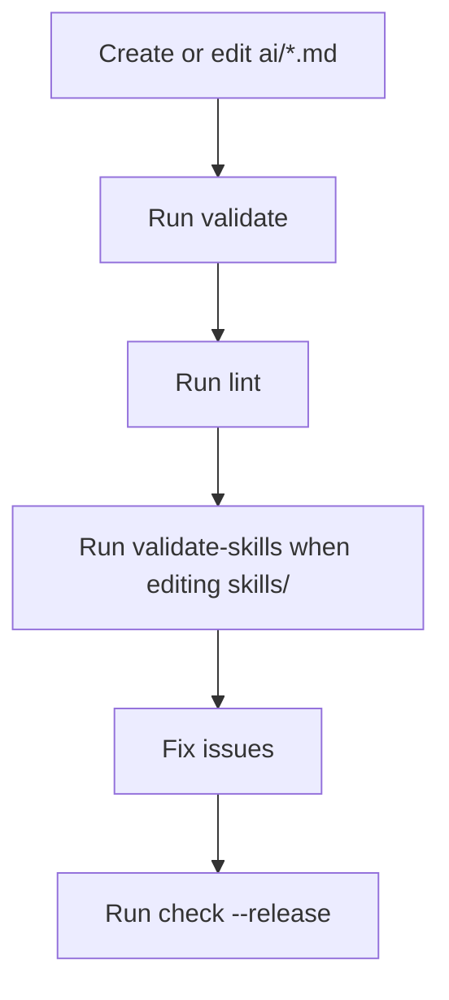

# AI folder layout and `scripts/ai.ts`

The `ai/` directory is a structured registry for AI-facing prompts, instructions, templates, workflows, and documentation. Installable skills live in the root `skills/` directory so they can be installed from `davidsneighbour/ai/skills`.

## Folder layout

Recommended structure:

```text
ai/
├── docs/
├── prompts/
└── shared/
skills/
└── <skill-id>/
    └── SKILL.md
```

Practical meaning:

* files under `ai/docs/` are treated as docs
* installable skills live under `skills/`
* everything else defaults to prompt content unless frontmatter says otherwise

Expected filename suffixes:

* `.doc.md`
* `.skill.md`
* `.prompt.md`

## What `scripts/ai.ts` does

The script scans `ai/` recursively and turns each Markdown file into a registry item with:

* `id`
* `title`
* `kind`
* file paths
* parsed frontmatter
* Markdown body

It then provides commands to inspect and enforce the registry.

## Main commands

```bash
node ./scripts/ai.ts list
node ./scripts/ai.ts show --id some-id
node ./scripts/ai.ts validate
node ./scripts/ai.ts lint
node ./scripts/ai.ts validate-skills
node ./scripts/ai.ts drift-report
node ./scripts/ai.ts export-schemas
node ./scripts/ai.ts build-documentation
node ./scripts/ai.ts setup --prompts --mode glob
node ./scripts/ai.ts check --release
```

## What each command is for

* `list` shows all recognised AI items
* `show` prints one item in detail
* `validate` checks frontmatter against the schema
* `lint` checks naming, descriptions, empty bodies, and metadata conventions
* `validate-skills` checks direct child directories under `skills/` for Codex-style `SKILL.md` files
* `drift-report` lists unknown frontmatter keys across the registry
* `export-schemas` writes JSON Schema files from the shared Zod schemas
* `build-documentation` refreshes generated README prompt-file configuration guidance
* `setup --prompts` writes VS Code prompt file locations into the configured workspace settings file
* `check` runs validation and linting together

## Validation vs linting

This distinction matters:

* validation checks schema correctness
* linting checks project policy and maintenance quality

Examples of lint-only checks include wrong file suffixes, missing descriptions, empty bodies, and unknown frontmatter keys. Skill directory validation is separate because it validates installable `SKILL.md` directories instead of registry Markdown files.

## Why this setup is useful

This system gives the repository:

* a single place for AI-related content
* predictable metadata
* safer refactors
* CLI inspection and automation support
* exportable schemas for tooling
* protection against schema drift

## Recommended workflow


```mermaid
flowchart TD
    A[Create or edit ai/*.md] --> B[Run validate]
    B --> C[Run lint]
    C --> D[Run validate-skills when editing skills/]
    D --> E[Fix issues]
    E --> F[Run check --release]
```

## Contributor rules

* keep registry files inside `ai/`
* keep installable skills inside `skills/`
* always use YAML frontmatter
* prefer explicit `id`, `title`, and `description`
* use the correct folder and filename suffix for each item type
* run `node ./scripts/ai.ts validate-skills` after changing installable skill directories
* run `node ./scripts/ai.ts build-documentation` after prompt folder or prompt setting changes
* run `node ./scripts/ai.ts setup --prompts --mode glob` to configure local VS Code prompt file locations
* run `node ./scripts/ai.ts check --release` before considering changes clean
